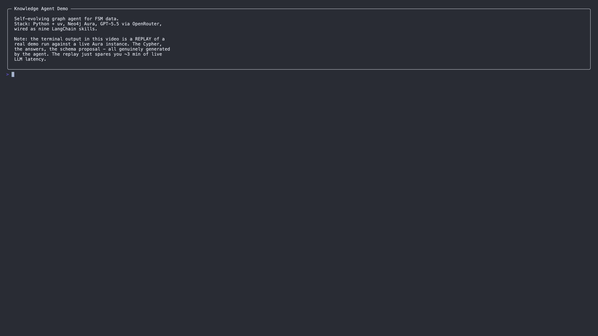
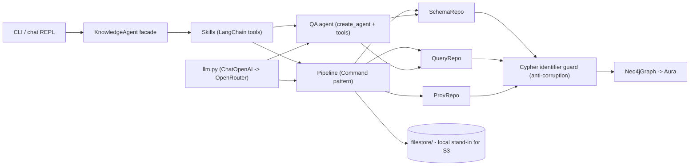

# knowledge-agent-example

Self-evolving graph agent for field-service-management (FSM) data. A small POC
that demonstrates:

1. Ingesting structured FSM data (customers, locations, jobs) into a Neo4j
   property graph with PROV-O style provenance.
2. An LLM agent that answers natural-language questions by generating Cypher
   against the live schema, iterating when its first query errors.
3. A second agent flow that proposes schema extensions when it sees messy new
   data (permits, in five different formats), pauses for human approval via
   LangGraph's `interrupt()`, applies the schema, and ingests the data.
4. Cross-schema queries that join the original entities to the newly added
   ones with zero code changes between Part 1 and Part 2.
5. All of the above exposed as LangChain **skills (tools)** so an agent can
   compose them turn-by-turn in an interactive chat.

## Demo video

A 13-minute walkthrough covering the architecture, all twelve task questions,
and the human-in-the-loop schema-evolution moment.

[](https://youtu.be/rkGu-SL_Rlk)

Watch on YouTube: <https://youtu.be/rkGu-SL_Rlk>. An offline copy ships with the
repo as [`final_demo.mp4`](final_demo.mp4) (1920x1080, ~27 MB) if you'd rather
play it locally.

What's in it:

| Range | Beat | Content |
|---|---|---|
| 00:00 - 02:25 | 01-02 | Replay disclaimer + architecture overview |
| 02:25 - 06:15 | 03-09 | Part 1: reset, seed, six base-schema questions |
| 06:15 - 08:15 | 10-11 | Part 2 schema proposal + HITL approval |
| 08:15 - 12:00 | 12-16 | Six cross-schema questions |
| 12:00 - 13:02 | 17 | Wrap-up + repo link |

## Stack

- **Python 3.12** with [uv](https://docs.astral.sh/uv/) for env + deps.
- **Neo4j 5**, hosted on [Neo4j Aura](https://console.neo4j.io) (free tier).
- **LangChain 1.x** (`langchain`, `langchain-neo4j`, `langchain-openai`) +
  `langchain.agents.create_agent` for the skill-calling agent;
  `langgraph` for the `interrupt()`-based human-approval pattern.
- **OpenRouter** as the LLM gateway, pinned to `openai/gpt-5.5` by default.
- **Rich** for terminal output (CLI only - the library uses stdlib `logging`).

## Architecture



Layer responsibilities:

- **Repositories** (`repositories/`) own all Cypher. `SchemaRepository` reads
  schema with a TTL cache and writes `:SchemaChangeProposal` audit nodes;
  `QueryRepository` runs parameterised queries and refuses writes in
  `run_readonly`; `ProvenanceRepository` writes `:Source` nodes and answers
  "where did this come from".
- **Pipeline** orchestrates seeding and schema evolution. Every
  identifier the LLM produces goes through `identifiers.safe_*`
  (anti-corruption layer) before being interpolated into Cypher. Writes are
  UNWIND-batched by label / relationship type.
- **QA agent** (`qa.py`) replaces the deprecated `GraphCypherQAChain` with
  `create_agent` + two tools (`get_schema`, `run_cypher_readonly`), letting
  the LLM iterate on its query when it errors.
- **Skills** (`skills.py`) wrap the facade as `@tool`-decorated functions
  for the chat agent. The `apply_schema_evolution` skill uses LangGraph's
  `interrupt()` to pause the agent until the operator approves.

Every imported node carries:

- `cid` - a deterministic content-addressed id (sha1-derived; **not** a
  Wikidata Q-number despite the `Q` prefix).
- `prov_source_uri`, `prov_source_sha256`, `prov_media_type`,
  `prov_ingested_at`, `prov_derived_by` - PROV-O slice.
- A `WAS_DERIVED_FROM` edge to a `:Source` node.

Raw payloads are copied into `./filestore/` (a stand-in for S3 - see
"Out of scope" below) and referenced from the graph by URI.

## Skills

The agent's surface area maps 1:1 to the use cases in the brief. Each skill is
a `@tool`-decorated function in `src/knowledge_agent/skills.py`; the chat
agent decides which to call based on docstring + user intent.

| Skill | Use-case from the brief |
|---|---|
| `inspect_schema` | "Read an existing schema" before answering a question. |
| `answer_question(question)` | Part 1 & Part 2 NL questions; generates and executes Cypher, iterates on errors. |
| `propose_schema_evolution(payloads_dir)` | "Propose new node types, relationships, properties" with rationale. Read-only. |
| `apply_schema_evolution(payloads_dir, activity_name)` | Apply + ingest. Triggers a LangGraph `interrupt()` so the operator approves before any writes. |
| `list_sources` | Show every raw payload the graph was built from. |
| `show_provenance(label, key, value)` | "Where did this fact come from?" - PROV-O lookup; rejects invalid Cypher identifiers. |
| `list_schema_changes` | Audit log of every `:SchemaChangeProposal` (the Command pattern's applied/declined record). |
| `seed_base_data` | Bootstrap Part 1's `Customer`/`Location`/`Job` graph. |
| `reset_graph(confirm)` | Wipe everything; guarded by `confirm="yes-wipe"`. |

Inspect them at runtime:

```bash
uv run knowledge-agent skills
```

The agent system prompt (in `chat.py`) tells the LLM the operating rules:
always call `inspect_schema` before writing Cypher, only call
`apply_schema_evolution` after the user agrees, etc.

## Layout

```
.
|-- data/
|   |-- seed/            # customers.json, locations.json, jobs.json
|   `-- permits/         # five mixed-format payloads for Part 2
|-- filestore/           # local "S3" - populated on first run
|-- scripts/
|   |-- demo.py          # one-shot end-to-end demo
|   `-- loom_script.md   # ~7-minute walkthrough script
|-- src/knowledge_agent/
|   |-- chat.py          # create_agent REPL; handles interrupt()-based HITL
|   |-- cli.py           # `knowledge-agent <cmd>`; CLI-side Confirm.ask approver
|   |-- config.py        # pydantic-settings loading .env
|   |-- demo.py          # demo flow (used by CLI and scripts/)
|   |-- facade.py        # KnowledgeAgent - composition root
|   |-- identifiers.py   # ACL: safe_label / safe_relationship_type / safe_property_name
|   |-- llm.py           # ChatOpenAI configured for OpenRouter (max_retries=3)
|   |-- pipeline.py      # seed import + schema-evolution flow (Command pattern)
|   |-- prov.py          # PROV-O helpers, content id, filestore writes
|   |-- qa.py            # create_agent-based Cypher Q&A (replaces GraphCypherQAChain)
|   |-- repositories/    # SchemaRepository / QueryRepository / ProvenanceRepository
|   `-- skills.py        # LangChain tools backed by the facade
|-- tests/
|   |-- test_safe_identifiers.py   # ACL regex tests (no DB needed)
|   `-- test_make_content_id.py    # determinism + namespace isolation
|-- pyproject.toml
|-- .env                 # gitignored - your local credentials
`-- .env.example         # template (Aura + OpenRouter)
```

## Quickstart (Neo4j Aura)

```bash
# 1. Install deps and create the venv
uv sync

# 2. Get a hosted Neo4j instance
#    - Sign up at https://console.neo4j.io
#    - Click "New instance" -> "AuraDB Free"
#    - Save the credentials file ONCE (URI, username, password)

# 3. Configure .env
cp .env.example .env
$EDITOR .env
# Paste the Aura NEO4J_URI / NEO4J_USERNAME / NEO4J_PASSWORD
# and your OpenRouter API key.

# 4. Smoke-test
uv run knowledge-agent skills
uv run knowledge-agent reset       # wipes the (empty) Aura instance

# 5. Run the full demo (Part 1 + Part 2)
uv run python scripts/demo.py

# 6. Or talk to the agent interactively
uv run knowledge-agent chat
# you> what's in the graph?
# you> seed the base data and tell me which customers spent the most in 2026
# you> propose a schema for the files in data/permits, then apply it
# you> are any of our delinquent customers sitting on open permits?
```

To skip the "press Enter" pauses when recording the Loom:

```bash
uv run python scripts/demo.py --auto
```

## Human-in-the-loop approval

`apply_schema_evolution` is the only skill that writes the graph schema, and
it's gated by an explicit human-approval step:

- **CLI path** (`knowledge-agent evolve`, `python scripts/demo.py`) - the
  proposal is rendered in a `rich` panel and `Confirm.ask` reads y/n from
  stdin. Familiar Unix behavior.
- **Chat path** (`knowledge-agent chat`) - the skill calls LangGraph's
  `interrupt(...)` with the proposal as payload. `agent.invoke` returns with
  an `__interrupt__` key, the REPL renders the proposal and asks y/n, and
  resumes the agent via `Command(resume="approve" | "decline")`.

Either way the proposal is **always** persisted as a
`:SchemaChangeProposal` audit node (see below) - declined proposals are
recorded with `applied=false`.

## Schema-change audit log

Every call to the evolution flow writes one `:SchemaChangeProposal` node
(Command pattern). Query it directly in the Aura browser:

```cypher
MATCH (p:SchemaChangeProposal)
RETURN p.id, p.activity_name, p.applied, p.applied_at
ORDER BY p.applied_at ASC
```

The full proposal JSON is on `p.proposal_json` for later replay / revert.
Inside the chat agent, the same view is one tool call away:

```
you> show me the schema-change audit log
```

## How schema evolution decides node vs. property

The proposal prompt is opinionated about three things, which together push the
LLM toward the right calls without it having to "know" the domain:

- **Lifecycle independence.** If an entity has its own create/update events
  (e.g. an inspection that can pass or fail independently of the permit), it
  becomes its own node.
- **1:N relationships.** If one payload field cleanly maps to many of
  something (inspections per permit), that's a node + relationship.
- **Existing entity joins.** Anything that already lives in the graph
  (`Customer`, `Location`, `Job`) gets joined to via its existing key, not
  duplicated.

Strict identifier rule: every label, relationship type, and property name the
LLM produces must match `^[A-Za-z_][A-Za-z0-9_]{0,63}$`. The
`identifiers.safe_*` helpers reject anything else before it gets near Cypher,
which closes off the obvious injection vector ("`Customer) DETACH DELETE n //`"
as a label).

## Provenance & "where did this fact come from"

Every node answers two questions out of the box, either via Cypher:

```cypher
MATCH (n:Permit {permit_no: "AUS-MECH-2026-04881"})-[:WAS_DERIVED_FROM]->(s:Source)
RETURN n.cid, s.uri, s.sha256, n.prov_derived_by, n.prov_ingested_at
```

...or by asking the agent: *"where did permit AUS-MECH-2026-04881 come from?"*
which triggers the `show_provenance` skill.

- *Where did the raw payload land?* `s.uri` resolves to a file in `filestore/`.
- *Which pipeline run wrote this node?* `n.prov_derived_by` is one of
  `seed_import`, `permit_evolution_v1`, etc.

## APOC on Aura

The QA agent's `inspect_schema` uses `langchain_neo4j.Neo4jGraph` with
`enhanced_schema=True`, which calls `apoc.meta.schema`. Aura Free includes
APOC Core (with `apoc.meta.schema` in the documented subset) so this works
out of the box. If you point this at a self-hosted Neo4j without APOC,
construct the session with `enhanced_schema=False` and the schema text will
still include labels / relationships / property names just without sample
values.

## Tests

The brief explicitly de-prioritises tests, but the two pure functions guarding
correctness and security are too cheap not to cover:

```bash
uv run pytest -q
```

- `tests/test_safe_identifiers.py` - the ACL regex; rejects every shape of
  injection payload we could think of (newlines, semicolons, backticks,
  non-ASCII, the canonical `Customer) DETACH DELETE n //`).
- `tests/test_make_content_id.py` - determinism, namespace isolation, and
  format - the identity anchor for every node.

Both run with no DB and no LLM credentials.

## Out of scope (on purpose)

- **Privacy / ACL.** The graph is read in full by the QA agent. A real
  deployment needs row-level filtering, column suppression for PII, and an
  authentication layer between the user and the agent.
- **Filestore = S3.** `filestore/` is a local directory standing in for an S3
  bucket. The `prov_source_uri` already looks like `local-prov-store://...`
  so swapping in a real bucket is a one-line change.
- **Full eval harness for the Cypher generator.** A real project would replay
  a fixed Q&A set against schema snapshots in CI.
- **UI.** All interaction is CLI + Neo4j browser.

## License

Copyright (c) 2026 Tomasz Gorka.

This work is licensed under the [Creative Commons
Attribution-NonCommercial 4.0 International License][cc-by-nc]

Full text in [`LICENSE`](LICENSE).

[cc-by-nc]: https://creativecommons.org/licenses/by-nc/4.0/
